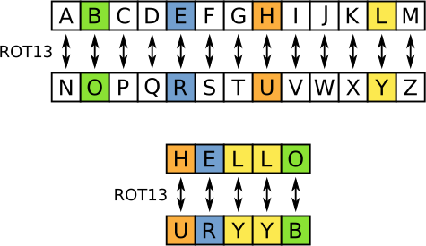

# Mod 26

## Description

Cryptography can be easy, do you know what ROT13 is? ```cvpbPGS{arkg_gvzr_V'yy_gel_2_ebhaqf_bs_ebg13_jdJBFOXJ}```

## Hints

* This can be solved online if you don't want to do it by hand!

## Walkthrough

The room name, Mod 26, refers to an important concept in cryptography known as [modular arithmetic](https://www.math.uci.edu/~mathcircle/materials/Modular_Arithmetic_and_Cryptography_Jan22_2015.pdf "Article about modular arithmetic and its uses in cryptography"). In Modular arithmetic, numbers wrap around after reaching the modulus, which in this case is 26, where each number represents one letter of the English alphabet.

[ROT-13](https://en.wikipedia.org/wiki/ROT13 "ROT-13 Wikipedia Article"), short for "rotate by 13", refers to a type of shift cipher where letters are enciphered by adding 13 to their numeric value, with a mod of 26. For example, if A is equal to 0 then A becomes N when 13 is added. When 13 is added to N then the result is A, because of mod 26 we end up wrapping back around to 0. This means that encryption and decryption for ROT-13 is exactly the same, just add 13.



