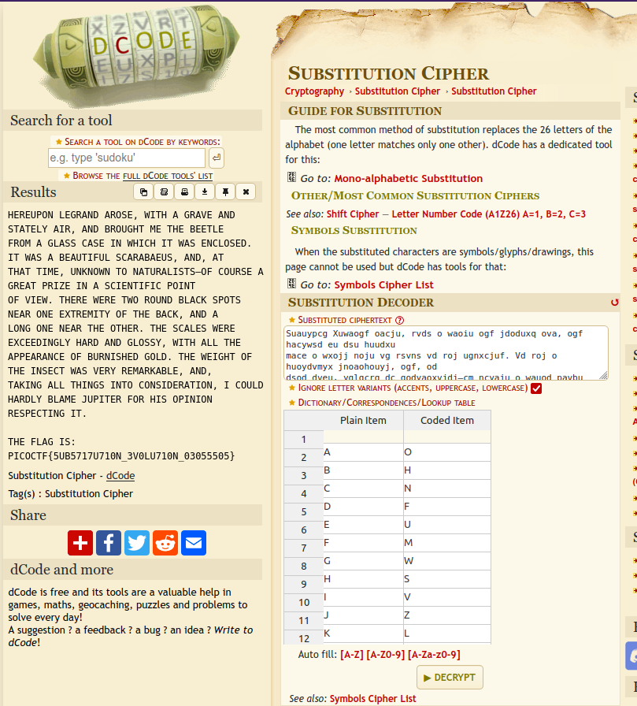

# Substitution0

## Description

A message has come in but it seems to be all scrambled. Luckily it seems to have the key at the beginning. Can you crack this substitution cipher? Download the message [here](https://artifacts.picoctf.net/c/153/message.txt "PicoCTF link to download enciphered flag text file").

## Hints

* Try a frequency attack. An online tool might help.

## Walkthrough

If we open the enciphered flag found in the [message.txt](./message.txt "Enciphered flag text file") file we'll find the following text.

```
OHNFUMWSVZLXEGCPTAJDYIRKQB

Suauypcg Xuwaogf oacju, rvds o waoiu ogf jdoduxq ova, ogf hacywsd eu dsu huudxu
mace o wxojj noju vg rsvns vd roj ugnxcjuf. Vd roj o huoydvmyx jnoaohouyj, ogf, od
dsod dveu, yglgcrg dc godyaoxvjdj—cm ncyaju o wauod pavbu vg o jnvugdvmvn pcvgd
cm ivur. Dsuau ruau drc acygf hxonl jpcdj guoa cgu ukdauevdq cm dsu honl, ogf o
xcgw cgu guoa dsu cdsua. Dsu jnoxuj ruau uknuufvgwxq soaf ogf wxcjjq, rvds oxx dsu
oppuoaognu cm hyagvjsuf wcxf. Dsu ruvwsd cm dsu vgjund roj iuaq aueoalohxu, ogf,
dolvgw oxx dsvgwj vgdc ncgjvfuaodvcg, V ncyxf soafxq hxoeu Zypvdua mca svj cpvgvcg
aujpundvgw vd.

Dsu mxow vj: pvncNDM{5YH5717Y710G_3I0XY710G_03055505}
```

We know the first part of text, ```OHNFUMWSVZLXEGCPTAJDYIRKQB```, is the key and based on the title of the CTF and the appearance of the message we can guess that the text was enciphered using a substitution cipher. The length of the key is 26 letters long so most likely it represents the new alphabet.

| **ORIGINAL** | **--><--** | **SUBSTITUTE** |
|:------------:|:----------:|:--------------:|
| A            | --><--     | O              |
| B            | --><--     | H              |
| C            | --><--     | N              |
| D            | --><--     | F              |
| E            | --><--     | U              |
| F            | --><--     | M              |
| G            | --><--     | W              |
| H            | --><--     | S              |
| I            | --><--     | V              |
| J            | --><--     | Z              |
| K            | --><--     | L              |
| L            | --><--     | X              |
| M            | --><--     | E              |
| N            | --><--     | G              |
| O            | --><--     | C              |
| P            | --><--     | P              |
| Q            | --><--     | T              |
| R            | --><--     | A              |
| S            | --><--     | J              |
| T            | --><--     | D              |
| U            | --><--     | Y              |
| V            | --><--     | I              |
| W            | --><--     | R              |
| X            | --><--     | K              |
| Y            | --><--     | Q              |
| Z            | --><--     | B              |

Deciphering the text manually would take too long, thankfully for us, there are online tools to automate this process for us. One such tool is [DCode's Substitution Cipher Tool](https://www.dcode.fr/substitution-cipher "DCode website substitution cipher tool"), we just plug in the original alphabet and the substitution alphabet and hit the decrypt button.



Once we've deciphered the text we'll see a fragment from the famous short story "[The Gold-Bug](https://en.wikipedia.org/wiki/The_Gold-Bug "Wikipedia page for The Gold-Bug by Edgar Allan Poe")" by Edgar Allan Poe and the flag.

```
HEREUPON LEGRAND AROSE, WITH A GRAVE AND STATELY AIR, AND BROUGHT ME THE BEETLE
FROM A GLASS CASE IN WHICH IT WAS ENCLOSED. IT WAS A BEAUTIFUL SCARABAEUS, AND, AT
THAT TIME, UNKNOWN TO NATURALISTS—OF COURSE A GREAT PRIZE IN A SCIENTIFIC POINT
OF VIEW. THERE WERE TWO ROUND BLACK SPOTS NEAR ONE EXTREMITY OF THE BACK, AND A
LONG ONE NEAR THE OTHER. THE SCALES WERE EXCEEDINGLY HARD AND GLOSSY, WITH ALL THE
APPEARANCE OF BURNISHED GOLD. THE WEIGHT OF THE INSECT WAS VERY REMARKABLE, AND,
TAKING ALL THINGS INTO CONSIDERATION, I COULD HARDLY BLAME JUPITER FOR HIS OPINION
RESPECTING IT.

THE FLAG IS: PICOCTF{5UB5717U710N_3V0LU710N_03055505}
```

Fun Fact: "[The Gold-Bug](https://en.wikipedia.org/wiki/The_Gold-Bug "Wikipedia page for The Gold-Bug by Edgar Allan Poe")" is considered one of the best examples of cryptography in fiction. Edgar Allan Poe was a huge fan of cryptography and famously claimed he could solve any substitution cipher sent to him. He would do this through the use of [frequency analysis](https://en.wikipedia.org/wiki/Frequency_analysis "Wikipedia page for frequency analysis"), a process he explains thoroughly in the short story. This story would also popularize cryptograms and serve as inspiration for many to become code-breakers, such as the famous cryptographers [Leo Marks](https://en.wikipedia.org/wiki/Leo_Marks "Wikipedia page for Leo Marks") and [William F. Friedman](https://en.wikipedia.org/wiki/William_F._Friedman "Wikipedia page for William F. Friedman")

```PICOCTF{5UB5717U710N_3V0LU710N_03055505}```
