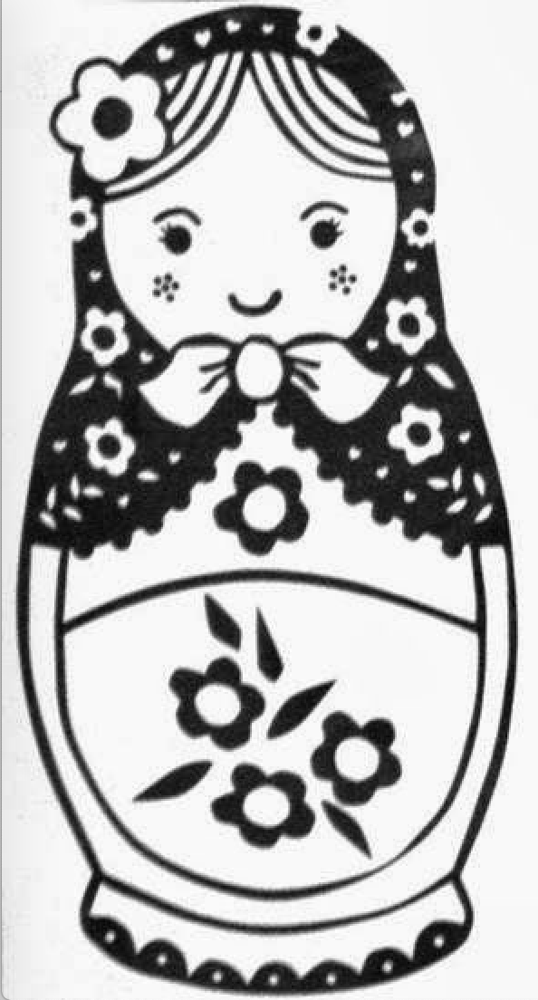

# Matryoshka Doll

## Description

Matryoshka dolls are a set of wooden dolls of decreasing size placed one inside another. What's the final one? Image: [this](./dolls.jpg "Image Of Matryoshka Doll")

## Hints

* Wait, you can hide files inside files? But how do you find them?

* Make sure to submit the flag as picoCTF{XXXXX}

## Walkthrough

The name of this room implies something hidden within the [doll image](./dolls.jpg "Image Of Matryoshka Doll"). [Matryoshka Dolls](https://en.wikipedia.org/wiki/Matryoshka_doll "Wikipedia Article On Matryoshka Dolls"), sometimes referred to as [Russian nesting dolls](https://en.wikipedia.org/wiki/Matryoshka_doll "Wikipedia Article On Russian Nesting Dolls"), are wooden dolls that get progressively smaller so they can fit nicely inside eachother. When you open the first doll you'll find another and another until you finally get to the smallest doll.



A good place to start, when it comes to image forensics, is a quick review of the metadata. Reviewing the image metadata with [exiftool](https://en.wikipedia.org/wiki/ExifTool "Exiftool Wikipedia Article") reveals our first hint that this picture is more than what it appears to be.

```
$ exiftool dolls.jpg

[...OUTPUT REDACTED FOR BREVITY...]

Warning                         : [minor] Trailer data after PNG IEND chunk

[...OUTPUT REDACTED FOR BREVITY...]
```

We can see in the exiftool output shown above that the metadata contains a warning that data continues after the [PNG IEND chunk](http://www.libpng.org/pub/png/spec/1.2/PNG-Chunks.html "Libpng Documentation For PNG Specifications"). This warning is interesting for two reasons. First, it implies that the doll image is not a JPEG but rather a PNG. More importantly, it also suggests data exists after the image is supposed to end.

We can verify that [dolls.jpg](./dolls.jpg "Image Of Matryoshka Doll") is actually a PNG using the [Linux file command](https://www.geeksforgeeks.org/file-command-in-linux-with-examples/ "Geeks For Geeks Article On Linux File Command").

```
$ file dolls.jpg
dolls.jpg: PNG image data, 594 x 1104, 8-bit/color RGBA, non-interlaced
```

Using a tool like [Binwalk](https://www.kali.org/tools/binwalk/ "Binwalk Documentation On Kali Linux") we can try to carve out whatever data exists after the PNG IEND chunk. Binwalk is a common tool used in image forensics, steganography and CTF challenges to extract hidden files.

Binwalk command for file extraction: ```binwalk -e example.png```

```
$ binwalk -e dolls.jpg

DECIMAL       HEXADECIMAL     DESCRIPTION
--------------------------------------------------------------------------------
0             0x0             PNG image, 594 x 1104, 8-bit/color RGBA, non-interlaced
3226          0xC9A           TIFF image data, big-endian, offset of first image directory: 8
272492        0x4286C         Zip archive data, at least v2.0 to extract, compressed size: 378942, uncompressed size: 383937, name: base_images/2_c.jpg
651600        0x9F150         End of Zip archive, footer length: 22
```

Once we finish extracting the files from the first image we'll find another doll image named [2_c.jpg](./2_c.jpg "Second Russian Nesting Doll Image")


Again we'll use Binwalk to extract files from the new image.

```
$ binwalk -e 2_c.jpg

DECIMAL       HEXADECIMAL     DESCRIPTION
--------------------------------------------------------------------------------
0             0x0             PNG image, 526 x 1106, 8-bit/color RGBA, non-interlaced
3226          0xC9A           TIFF image data, big-endian, offset of first image directory: 8
187707        0x2DD3B         Zip archive data, at least v2.0 to extract, compressed size: 196042, uncompressed size: 201444, name: base_images/3_c.jpg
383804        0x5DB3C         End of Zip archive, footer length: 22
383915        0x5DBAB         End of Zip archive, footer length: 22
```

Hidden within [2_c.jpg](./2_c.jpg "Second Russian Nesting Doll Image") we'll find a smaller Russian nesting doll named [3_c.jpg](./3_c.jpg "Third Russian Nesting Doll Image")


Again we'll use binwalk on the new image.

```
$ binwalk -e 3_c.jpg

DECIMAL       HEXADECIMAL     DESCRIPTION
--------------------------------------------------------------------------------
0             0x0             PNG image, 428 x 1104, 8-bit/color RGBA, non-interlaced
3226          0xC9A           TIFF image data, big-endian, offset of first image directory: 8
123606        0x1E2D6         Zip archive data, at least v2.0 to extract, compressed size: 77650, uncompressed size: 79806, name: base_images/4_c.jpg
201422        0x312CE         End of Zip archive, footer length: 22
```

After extracting the files from [3_c.jpg](./3_c.jpg "Third Russian Nesting Doll Image") we'll find an even smaller Russian nesting doll image named [4_c.jpg](./4_c.jpg "Fourth Russian Nesting Doll")


Again we'll use Binwalk to extract files from the new image.

```
$ binwalk -e 4_c.jpg

DECIMAL       HEXADECIMAL     DESCRIPTION
--------------------------------------------------------------------------------
0             0x0             PNG image, 320 x 768, 8-bit/color RGBA, non-interlaced
3226          0xC9A           TIFF image data, big-endian, offset of first image directory: 8
79578         0x136DA         Zip archive data, at least v2.0 to extract, compressed size: 62, uncompressed size: 81, name: flag.txt
79784         0x137A8         End of Zip archive, footer length: 22
```

Finally, this time there are no more Matryoshka dolls, just a text file named [flag.txt](./flag.txt "Flag file") which contains this CTF's flag.

```
$ cat flag.txt
picoCTF{4cf7ac000c3fb0fa96fb92722ffb2a32}
```
