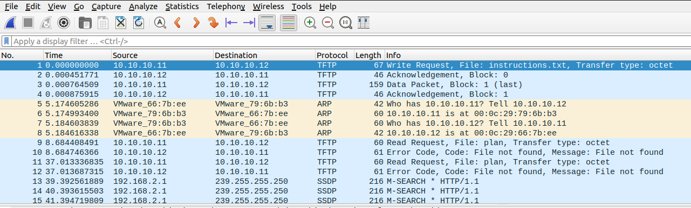
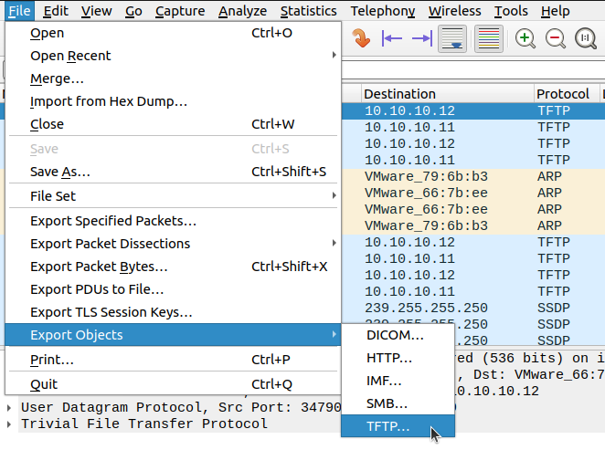
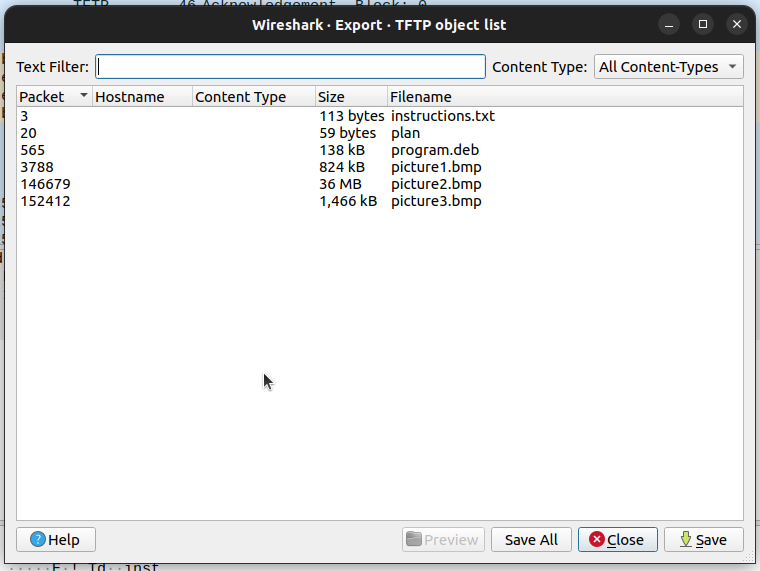

# Trivial Flag Transfer Protocol

## Description

Figure out how they moved the [flag](https://mercury.picoctf.net/static/e4836d9bcc740d457f4331d68129a0bc/tftp.pcapng "Pico CTF link to download PCAP file").

## Hints

* What are some other ways to hide data?

## Walkthrough

After we download the [pcap](https://en.wikipedia.org/wiki/Pcap "Wikipedia article for pcap") file we can open it in [WireShark](https://en.wikipedia.org/wiki/Wireshark "Wikipedia article on WireShark").



Looking through the output in the pcap file we'll notice that most of the network traffic uses the [Trivial File Transfer Protocol (TFTP)](https://en.wikipedia.org/wiki/Trivial_File_Transfer_Protocol "Wikipedia article for TFTP"), a protocol used for simple file transferring. We'll also notice mentions of various files like the first entry which references a file called "instructions.txt".

We can extract these files by clicking ```File -> Export Objects -> TFTP```, then clicking ```Save All```.





After exporting the objects, we'll see the following files in our downloads folder.

* [instructions.txt](./Assets/instructions.txt "Instructions text file exported from pcap")

* [plan](./Assets/plan "Plan file exported from pcap")

* [program.deb](./Assets/program.deb "Deb file exported from pcap")

* [picture1.bmp](./Assets/picture1.bmp "First bitmap exported from pcap")

* [picture2.bmp](./Assets/picture2.bmp "Second bitmap exported from pcap")

* [picture3.bmp](./Assets/picture3.bmp "Third bitmap exported from pcap")

