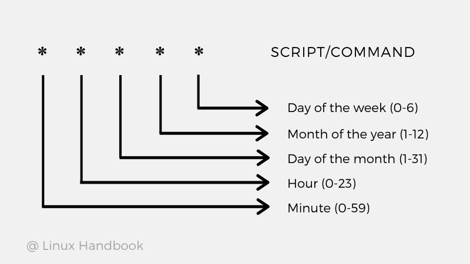
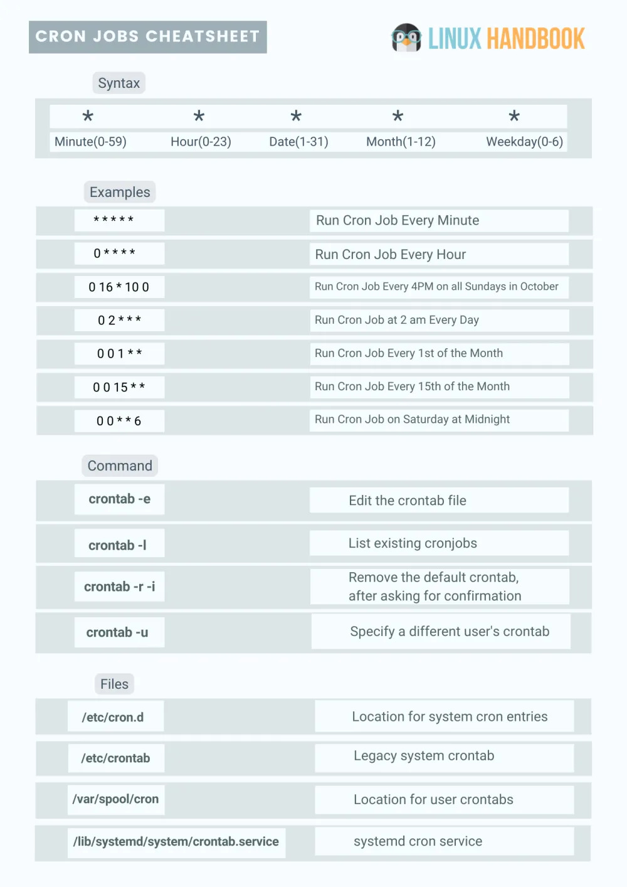

# Chrono

## Description

How to automate tasks to run at intervals on linux servers?

Additional details will be available after launching your challenge instance.

## Hints

* (None)

## Walkthrough

Sometimes it's important to automate repetitive tasks. Maybe you want to create a script that backs up some of your files and you want it to be run weekly, or maybe you have a clean up script that you would like to run daily. The best way to do this, in Linux, is through the use of [cron jobs](https://www.freecodecamp.org/news/cron-jobs-in-linux/ "freeCodeCamp lesson on cron jobs"). Cron jobs are automated tasks scheduled to run at specified intervals.

[Cron jobs](https://www.freecodecamp.org/news/cron-jobs-in-linux/ "freeCodeCamp lesson on cron jobs") can be found in the following places:

* ```/etc/crontab``` - System wide cron jobs, typically maintained by a system administrator. This is the most common place to find cron jobs.

* ```/var/spool/cron/``` and ```/var/spool/cron/crontabs``` - User-specific cronjobs. When you use the ```crontab``` command you're making changes to files in these directories.

* ```/etc/cron.d/``` - System-wide cron jobs that are different from those in ```/etc/crontab```, typically used for more specific or custom tasks.

* ```/etc/cron.daily/``` - Location of cron jobs that will be executed daily.

* ```/etc/cron.hourly/``` - Location of cron jobs that will be executed hourly.

* ```/etc/cron.weekly/``` - Location of cron jobs that will be executed weekly.

* ```/etc/cron.monthly/``` - Location of cron jobs that will be executed monthly.

* ```/etc/anacrontab``` - Cron jobs for systems that are not continuosly powered on like desktops or laptops.

When reading a crontab, you'll typically encounter syntax like this:

```0 3 * * * root sh /path/to/script.sh```

Meaning that every 3 hours ```/path/to/script.sh``` will be executed with root privileges. Crontabs adhere to the following syntax:


```
*   *   *   *   *  sh /path/to/script/script.sh
|   |   |   |   |              |
|   |   |   |   |      Command or Script to Execute        
|   |   |   |   |
|   |   |   |   |
|   |   |   |   |
|   |   |   | Day of the Week(0-6)
|   |   |   |
|   |   | Month of the Year(1-12)
|   |   |
|   | Day of the Month(1-31)
|   |
| Hour(0-23)
|
Min(0-59)
```



[Helpful cronjob cheatsheet](../../Assets/cron-jobs-cheatsheet.jpg "Cronjob cheatsheet"):



Now that we've scratched the surface of cron jobs and crontabs we have enough information to solve the challenge. Although I'd strongly reccomend working through this [freeCodeCamp lesson on cron jobs](https://www.freecodecamp.org/news/cron-jobs-in-linux/ "freeCodeCamp lesson on cron jobs"), in order to have a stronger understanding on the subject.

Moving on to the challenge, once we SSH into the target machine we'll be dropped into the home directory of "picoplayer". We can list all of the current users cron jobs with the command ```crontab -l```, the problem is that the user doesn't have any.

```
picoplayer@challenge:~$ crontab -l
no crontab for picoplayer
```

Next we'll check the system wide crontab by using the command ```cat /etc/crontab```, and this time we'll see no cronjobs but we will get the flag.

```
picoplayer@challenge:~$ cat /etc/crontab
# picoCTF{Sch3DUL7NG_T45K3_L1NUX_0bb95b71}
```
