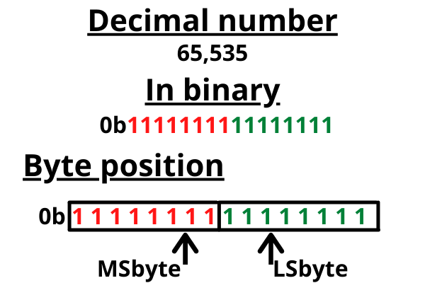
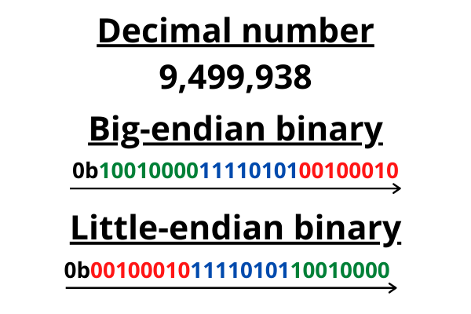

# Endianness

## Description

Know of little and big endian? [Source](https://artifacts.picoctf.net/c_titan/78/flag.c "Pico CTF link to download c program used in this challenge")

## Hints

* You might want to check the ASCII table to first find the hexadecimal representation of characters before finding the endianness.

* Read more about how endianness [here](https://en.wikipedia.org/wiki/Endianness "Wikipedia article on endianness")

## Walkthrough

In this challenge, we're asked if we're familiar with [little and big endian](https://en.wikipedia.org/wiki/Endianness "Wikipedia article on endianness"). We're also given the following c program named "[flag.c](./flag.c "C program that checks if user understands endianness")", which will test our understanding of endianness. Although the program is given to us, we do not need to analyze it to solve the CTF, so we'll ignore it.

```c
#include <stdio.h>
#include <stdlib.h>
#include <string.h>
#include <stdbool.h>
#include <ctype.h>
#include <time.h>

char *find_little_endian(const char *word)
{
    size_t word_len = strlen(word);
    char *little_endian = (char *)malloc((2 * word_len + 1) * sizeof(char));

    for (size_t i = word_len; i-- > 0;)
    {
        snprintf(&little_endian[(word_len - 1 - i) * 2], 3, "%02X", (unsigned char)word[i]);
    }

    little_endian[2 * word_len] = '\0';
    return little_endian;
}

char *find_big_endian(const char *word)
{
    size_t length = strlen(word);
    char *big_endian = (char *)malloc((2 * length + 1) * sizeof(char));

    for (size_t i = 0; i < length; i++)
    {
        snprintf(&big_endian[i * 2], 3, "%02X", (unsigned char)word[i]);
    }

    big_endian[2 * length] = '\0';
    return big_endian;
}

char *generate_random_word()
{
    printf("Welcome to the Endian CTF!\n");
    printf("You need to find both the little endian and big endian representations of a word.\n");
    printf("If you get both correct, you will receive the flag.\n");
    srand(time(NULL));

    int word_length = 5;
    char *word = (char *)malloc((word_length + 1) * sizeof(char));

    for (int i = 0; i < word_length; i++)
    {
        word[i] = (rand() % 26) + 'a';
    }

    word[word_length] = '\0';
    return word;
}

int main()
{
    char *challenge_word = generate_random_word();
    printf("Word: %s\n", challenge_word);
    fflush(stdout);

    char *little_endian = find_little_endian(challenge_word);
    size_t user_little_endian_size = strlen(little_endian);
    char user_little_endian[user_little_endian_size + 1];
    bool correct_flag = false;

    while (!correct_flag)
    {
        printf("Enter the Little Endian representation: ");
        fflush(stdout);
        scanf("%10s", user_little_endian);
        for (size_t i = 0; i < strlen(user_little_endian); i++)
        {
            user_little_endian[i] = toupper(user_little_endian[i]);
        }

        if (strncmp(user_little_endian, little_endian, user_little_endian_size) == 0)
        {
            printf("Correct Little Endian representation!\n");
            fflush(stdout);
            correct_flag = true;
        }
        else
        {
            printf("Incorrect Little Endian representation. Try again!\n");
            fflush(stdout);
        }
    }

    char *big_endian = find_big_endian(challenge_word);
    size_t user_big_endian_size = strlen(big_endian);
    char user_big_endian[user_big_endian_size + 1];

    bool final_flag = false;
    while (!final_flag)
    {
        printf("Enter the Big Endian representation: ");
        fflush(stdout);
        scanf("%10s", user_big_endian);
        for (size_t i = 0; i < strlen(user_big_endian); i++)
        {
            user_big_endian[i] = toupper(user_big_endian[i]);
        }

        if (strncmp(user_big_endian, big_endian, user_big_endian_size) == 0)
        {
            printf("Correct Big Endian representation!\n");
            fflush(stdout);
            final_flag = true;
        }
        else
        {
            printf("Incorrect Big Endian representation. Try again!\n");
            fflush(stdout);
        }
    }

    FILE *flag = fopen("flag.txt", "r");
    if (flag == NULL)
    {
        printf("Flag not found. Please run this on the server\n");
        fflush(stdout);
        exit(0);
    }

    char flag_content[100];
    fgets(flag_content, sizeof(flag_content), flag);
    printf("Congratulations! You found both endian representations correctly!\n");
    fflush(stdout);
    printf("Your Flag is: %s\n", flag_content);
    fflush(stdout);
    exit(0);

    return 0;
}
```

Before we discuss [endianness](https://www.freecodecamp.org/news/what-is-endianness-big-endian-vs-little-endian/ "freeCodeCamp article on little and big endian"), we should have an understanding of most and least significant bytes. For this explanation we'll use the decimal number 40,000 which in binary is represented as "10011100 01000000." If you look at the binary for this number, you'll notice it takes up two bytes. The byte on the left, "10011100," is the most significant byte, while the byte on the right, "01000000," is the least significant byte.

Why is one byte more significant than the other? Well, imagine you have 40,000 dollars and you're given the choice to add the number 1 to either side. Do you choose the left-most digit or the right-most? If you choose to add 1 to the right side you have 1 extra dollar, but if you choose the left side you have 10,000 extra dollars.

In summary, the most significant byte is the byte with the highest value, while the least significant byte is the byte with the lowest value.



[Endianness](https://www.freecodecamp.org/news/what-is-endianness-big-endian-vs-little-endian/ "freeCodeCamp article on little and big endian") refers to the order used when sending or receiving bytes. Some programs use "big-endian", while others use "little-endian". In big-endian, bytes are sent and received starting with the most significant byte and ending with the least significant byte. While in little-endian, the reverse is true. Simply put, little-endian sends binary data backwards, reading from right to left. While this may seem counter-intuitive, this process will make more sense if you ever decide to study assembly and pointers.

Here's an example of the number 40,000, represented as "10011100 01000000" in binary, in little and big endian format:

* Big-endian: 10011100 01000000 (Doesn't change, reads from left to right)

* Little-endian: 01000000 10011100 (Starts with least significant byte, reads right to left)




Now that we understand endianness, solving this challenge should be easy. We'll be given a random word and asked to represent it using either big or little endian.

```
Welcome to the Endian CTF!
You need to find both the little endian and big endian representations of a word.
If you get both correct, you will receive the flag.
Word: lntux
Enter the Little Endian representation: 
```

In this instance we're given the word "lntux". Converting these letters to their hexadecimal representation, we'll get "6c 6e 74 75 78". To represent these 5 bytes in little endian we'll simply type them in reverse order, leaving us with "78 75 74 6e 6c". After removing the spaces we're left with "7875746e6c".

```
Welcome to the Endian CTF!
You need to find both the little endian and big endian representations of a word.
If you get both correct, you will receive the flag.
Word: lntux
Enter the Little Endian representation: 7875746e6c
Correct Little Endian representation!
```

To represent the same word in big endian we don't need to do anything except remove the spaces from "6c 6e 74 75 78", leaving us with "6c6e747578".

```
Enter the Big Endian representation: 6c6e747578
Correct Big Endian representation!
Congratulations! You found both endian representations correctly!
Your Flag is: picoCTF{3ndi4n_sw4p_su33ess_cfe38ef0}
```

```picoCTF{3ndi4n_sw4p_su33ess_cfe38ef0}```

Fun Fact: The term "endian" comes from [Jonathan Swift](https://en.wikipedia.org/wiki/Jonathan_Swift "Wikipedia article on Jonathan Swift")'s famous novel "[Gulliver's Travels](https://en.wikipedia.org/wiki/Gulliver%27s_Travels "Wikipedia article on Gulliver's Travels")." In the story, we learn that the cause of division among the Lilliputians is based on whether they peel a boiled egg starting at the big end or the little end.
