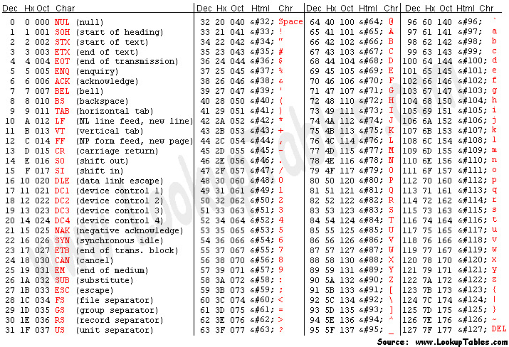

# Nice Netcat

## Description

There is a nice program that you can talk to by using this command in a shell: ```$ nc mercury.picoctf.net 7449```, but it doesn't speak English...

## Hints

* You can practice using netcat with this picoGym problem: [what's a netcat?](https://play.picoctf.org/practice/challenge/34 "What's a netcat? CTF")

* You can practice reading and writing ASCII with this picoGym problem: [Let's Warm Up](https://play.picoctf.org/practice/challenge/22 "Let's Warm Up CTF")

## Walkthrough

In the CTF description we're told that the server for ```mercury.picoctf.net``` is running a [Netcat](https://nmap.org/ncat/ "Netcat Official Website") listener on port ```7449```. Netcat is a networking tool commonly used to receive and transmit data using TCP or UDP.

If we connect to port ```7449``` on ```mercury.picoctf.net``` by using the command ```nc mercury.picoctf.net 7449``` we'll receive the following data.

```
$ nc mercury.picoctf.net 7449
112 
105 
99 
111 
67 
84 
70 
123 
103 
48 
48 
100 
95 
107 
49 
116 
116 
121 
33 
95 
110 
49 
99 
51 
95 
107 
49 
116 
116 
121 
33 
95 
102 
50 
100 
55 
99 
97 
102 
97 
125 
10 
```

```
112 105 99 111 67 84 70 123 103 48 48 100 95 107 49 116 116 121 33 95 110 49 99 51 95 107 49 116 116 121 33 95 102 50 100 55 99 97 102 97 125 10
```

These numbers at first glance might seem random but they all fall within the range of 0-127, which corresponds with the decimal representation of letters, numbers, and symbols in the [ASCII character set](https://www.asciitable.com/ "ASCII Codes").



Once we translate every decimal number to its ASCII representation we'll get the following flag.

```picoCTF{g00d_k1tty!_n1c3_k1tty!_f2d7cafa}```
