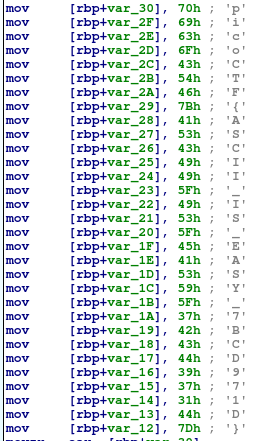

# ASCII FTW

## Description

This program has constructed the flag using hex ascii values. Identify the flag text by disassembling the program. You can download the file from [here](https://artifacts.picoctf.net/c/507/asciiftw "Pico CTF link to download ASCII FTW binary").

## Hints

* The combined range of hex-ascii for English alphabets and numerical digits is from 30 to 7A.

* Online hex-ascii converters can be helpful.

## Walkthrough

After we download the binary file, [asciiftw](./asciiftw "ASCII FTW binary program"), we'll need to open it in a disassembler like [Ghidra](https://ghidra-sre.org/ "Official website for the reverse engineering tool GHIDRA") or [IDA](https://hex-rays.com/ida-free/ "Official website for the reverse engineering tool IDA") to analyze its code and understand its functionality.

Once we load the program into the disassembler, we'll see a simple program where hexadecimal values are being loaded into memory.

