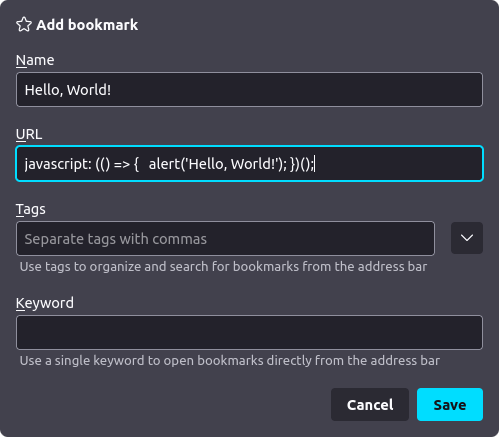
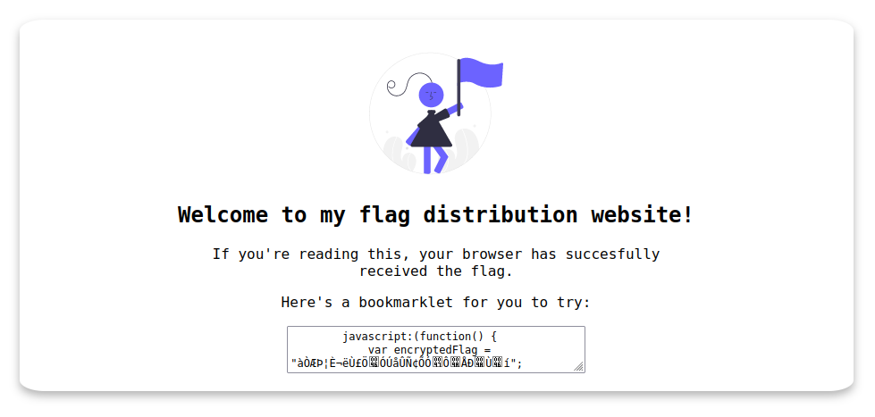
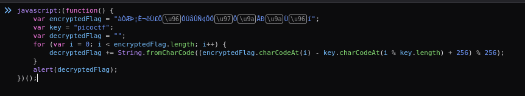
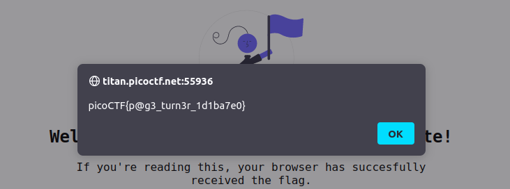

# Bookmarklet

## Description

Why search for the flag when I can make a bookmarklet to print it for me?

Additional details will be available after launching your challenge instance.

## Hints

* A bookmarklet is a bookmark that runs JavaScript instead of loading a webpage.

* What happens when you click a bookmarklet?

* Web browsers have other ways to run JavaScript too.

## Walkthrough

A [bookmarklet](https://www.freecodecamp.org/news/what-are-bookmarklets/ "freeCodeCamp article on bookmarklets") is a browser bookmark that executes JavaScript code instead of navigating to a website. It is created by saving JavaScript code in the URL field of your bookmarks bar instead of a URL.



The JavaScript code for a bookmarklet starts with the protocol ```javascript:```, followed by an [immediately invoked function expression (IIFE)](https://www.geeksforgeeks.org/immediately-invoked-function-expressions-iife-in-javascript/ "Geeks For Geeks tutorial on JavaScript IIFE's"), which allows for immediate execution of the code.

Now that we understand what a bookmarklet is, we can navigate to the URL provided after launching the CTF.



On the homepage we'll see a box with the following JavaScript code.

```js
javascript:(function() {
    var encryptedFlag = "àÒÆަȬë٣֖ÓÚåÛÑ¢ÕӗԚÅКٖí";
    var key = "picoctf";
    var decryptedFlag = "";
    for (var i = 0; i < encryptedFlag.length; i++) {
        decryptedFlag += String.fromCharCode((encryptedFlag.charCodeAt(i) - key.charCodeAt(i % key.length) + 256) % 256);
    }
    alert(decryptedFlag);
})();
```

The website tells us to save the code as a bookmarklet and run it, in order to get the flag. But we don't really need to do that. Instead we can copy the code and paste it into the developer console.



After we hit enter we'll see the flag.



```picoCTF{p@g3_turn3r_1d1ba7e0}```
