# Cookies

## Description

Who doesn't love cookies? Try to figure out the best one. http://mercury.picoctf.net:54219/

## Hints

* None

## Walkthrough

A first glance at the website shows an input where you can type the name of a type of cookie.

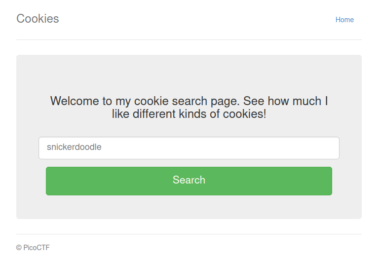

If we try the webpage out by providing the suggested text Snickerdoodle we'll see the text "I love snickerdoodle cookies!"

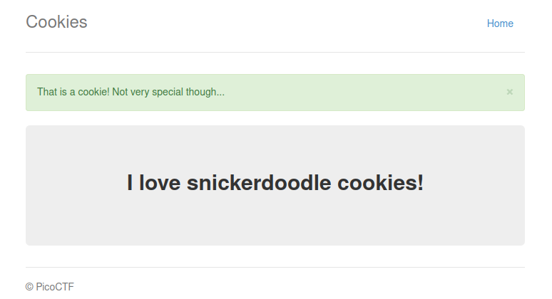

We'll also see a cookie has been created with a name of "name" and a value of 0.

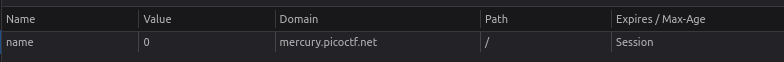

Next, we can try changing the cookie value to 1, just to see what happens. If we do this, we'll see the webpage returns the text for Chocolate Chip.

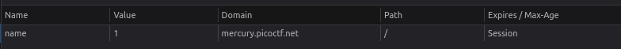

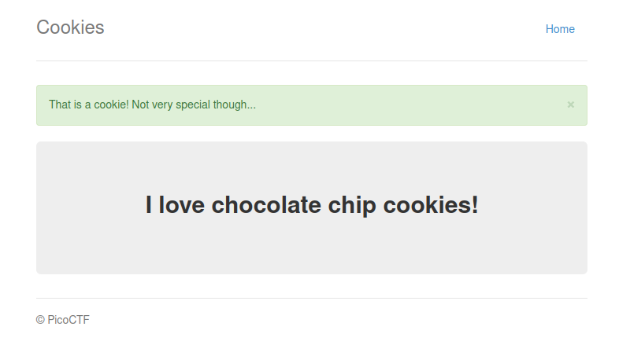

It appears that incrementing the cookie value will show us every type of cookie and possibly even the flag.

We can look for the highest cookie value by selecting a random high number and seeing what it returns. The cookie value 30 for example returns an error and rewrites our cookie, giving it a value of -1.

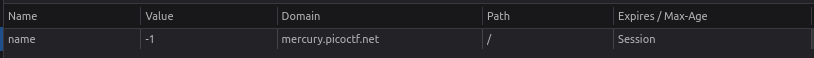

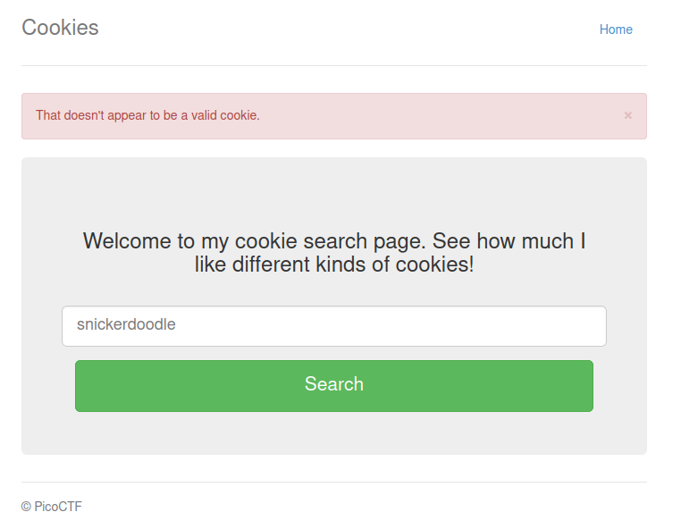

Checking the webpage with a cookie value of 29 does the same, but 28 returns Macademia.

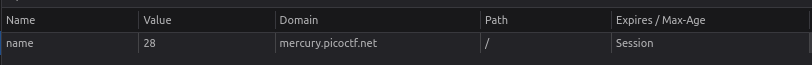

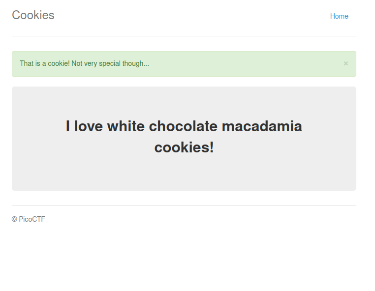

This suggests that our flag can be found within the cookie values of 0-28. After bruteforcing all possible cookie values between this range we'll find that the cookie with a value of 18 returns our flag.

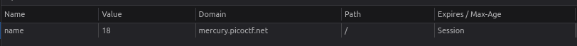

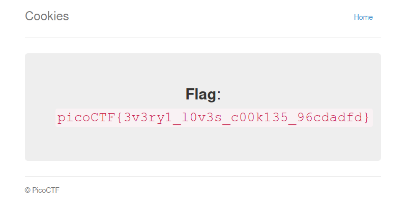

Flag: ```picoCTF{3v3ry1_l0v3s_c00k135_96cdadfd}```
