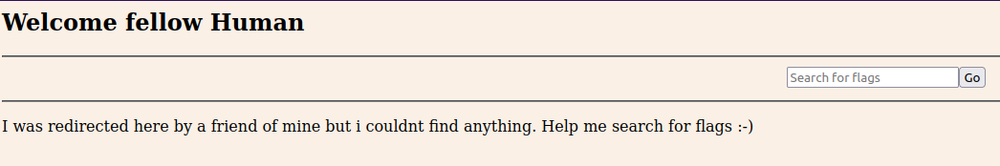

# Findme

## Description

Help us test the form by submiting the username as test and password as test!

Additional details will be available after launching your challenge instance.

## Hints

* any redirections?

## Walkthrough

Before logging in to the website, turn on Burp Suite and put the website in scope so we can monitor any network traffic.

Logging in using the credentials ```test:test!``` redirects us to the user homepage where we'll see a message that reads:

> Welcome fellow Human
>
> I was redirected here by a friend of mine but I couldn't find anything. Help me search for flags :-)



```http
POST /login HTTP/1.1
Host: saturn.picoctf.net
Accept-Language: en-US,en;q=0.5
Accept-Encoding: gzip, deflate
Content-Type: application/x-www-form-urlencoded
Content-Length: 30
Origin: http://saturn.picoctf.net
Connection: close
Referer: http://saturn.picoctf.net/

username=test&password=test%21
```

```http
HTTP/1.1 302 Found
X-Powered-By: Express
Location: /next-page/id=cGljb0NURntwcm94aWVzX2Fs
Vary: Accept
Content-Type: text/html; charset=utf-8
Content-Length: 120
Date: Mon, 19 Aug 2024 11:10:14 GMT
Connection: close

<p>Found. Redirecting to <a href="/next-page/id=cGljb0NURntwcm94aWVzX2Fs">/next-page/id=cGljb0NURntwcm94aWVzX2Fs</a></p>
```

```http
GET /next-page/id=cGljb0NURntwcm94aWVzX2Fs HTTP/1.1
Host: saturn.picoctf.net
Accept-Language: en-US,en;q=0.5
Accept-Encoding: gzip, deflate
Referer: http://saturn.picoctf.net/
Connection: close

```


```http
HTTP/1.1 200 OK
X-Powered-By: Express
Content-Type: text/html; charset=utf-8
Content-Length: 264
ETag: W/"108-PlcOMYcBpM14tkoLrMSzu1ev8gg"
Date: Mon, 19 Aug 2024 11:10:14 GMT
Connection: close

<!DOCTYPE html>
<head>
    <title>flag</title>
</head>
<body>
    <script>
        setTimeout(function () {
           // after 2 seconds
           window.location = "/next-page/id=bF90aGVfd2F5X2RmNDRjOTRjfQ==";
        }, 0.5)
      </script>
    <p></p>
</body>
```


```http
GET /next-page/id=bF90aGVfd2F5X2RmNDRjOTRjfQ== HTTP/1.1
Host: saturn.picoctf.net
Accept-Language: en-US,en;q=0.5
Accept-Encoding: gzip, deflate
Connection: close
Referer: http://saturn.picoctf.net/next-page/id=cGljb0NURntwcm94aWVzX2Fs

```

```http
HTTP/1.1 200 OK
X-Powered-By: Express
Content-Type: text/html; charset=utf-8
Content-Length: 229
ETag: W/"e5-LTjUGH/wFj4zC3orEfBV+FaVEVs"
Date: Mon, 19 Aug 2024 11:10:14 GMT
Connection: close

<!DOCTYPE html>
<head>
    <title>flag</title>
</head>
<body>
    <script>
        setTimeout(function () {
           // after 2 seconds
           window.location = "/home";
        }, 0.5)
      </script>
      <p></p>
</body>
```
