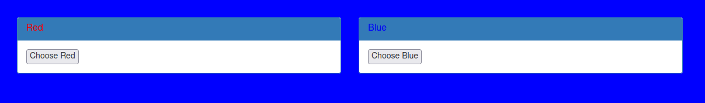

# GET aHEAD

## Description

Find the flag being held on this server to get ahead of the competition http://mercury.picoctf.net:45028/

## Hints

* Maybe you have more than 2 choices

* Check out tools like Burpsuite to modify your requests and look at the responses

## Walkthrough

If we visit [the website](http://mercury.picoctf.net:45028/ "CTF Website") we'll see two forms. The submit buttons for these forms read "Choose Red" and "Choose Blue". Clicking these buttons will change the color of the webpage.




Viewing the source code for this webpage we'll see that the red form uses the [GET Method](https://www.w3schools.com/tags/ref_httpmethods.asp "W3 Schools article on HTTP methods") while the blue form uses the [POST Method](https://www.w3schools.com/tags/ref_httpmethods.asp "W3 Schools article on HTTP methods").

```html
<form action="index.php" method="GET">
    <input type="submit" value="Choose Red"/>
</form>

<form action="index.php" method="POST">
    <input type="submit" value="Choose Blue"/>
</form>
```

While these are the most common [HTTP request methods](https://www.w3schools.com/tags/ref_httpmethods.asp "W3 Schools article on HTTP methods"), they are only a few of the several methods available. One such method being the [HEAD Request](https://http.dev/head "Article on HEAD Request"), hence the name of the room "GET aHEAD".

A HEAD request is nearly identical to a GET request except that it only receives the headers of an HTTP response without the body.

There are several ways to send a HEAD request, such as the command line, built-in browser tools, or [BurpSuite](https://www.softwaretestinghelp.com/how-to-use-burp-suite/ "BurpSuite setup and tutorial"). The easiest way being the command line. Below I will show how to send a HEAD request via the command line and also how to send the same request via BurpSuite.

In Linux, we can use the [curl command](https://www.geeksforgeeks.org/curl-command-in-linux-with-examples/ "Geeks For Geeks article on cURL") with the ```-I``` or ```--head``` flag to request the sites headers. In response the site will send us a header called ```flag``` with a value of ```picoCTF{r3j3ct_th3_du4l1ty_775f2530}```.

```
$ curl -I http://mercury.picoctf.net:45028/
HTTP/1.1 200 OK
flag: picoCTF{r3j3ct_th3_du4l1ty_775f2530}
Content-type: text/html; charset=UTF-8
```

In BurpSuite, once we've added the webpage to our scope and clicked around we can grab one of the GET requests out of the history, send it to the repeater where we can change the request line to HEAD like so.

```http
HEAD /index.php? HTTP/1.1
Host: mercury.picoctf.net:45028
Accept-Language: en-US,en;q=0.5
Accept-Encoding: gzip, deflate
Connection: close
```

Sending the request should result in the following HTTP Response.

```http
HTTP/1.1 200 OK
flag: picoCTF{r3j3ct_th3_du4l1ty_775f2530}
Content-type: text/html; charset=UTF-8
```
