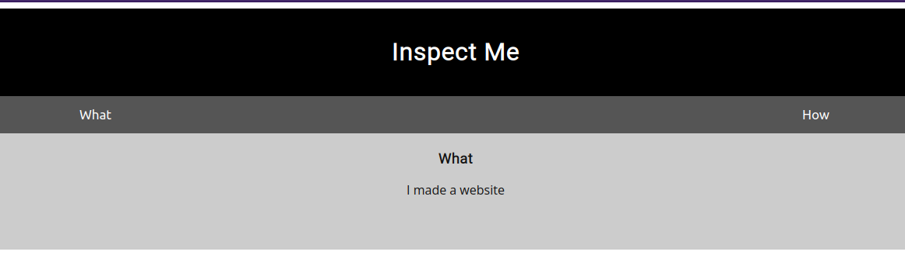

# Insp3ct0r

## Description

Kishor Balan tipped us off that the following code may need inspection: https://jupiter.challenges.picoctf.org/problem/41511/ (link) or http://jupiter.challenges.picoctf.org:41511

## Hints

* How do you inspect web code on a browser?

* There's 3 parts

## Walkthrough

Based on the title of the room we can assume that the flag will be found by inspecting the source code. Visiting the site will confirm this as well with the welcome message that reads "Inspect Me".



Looking through source code is an important part of most CTF's and even real world vulnerability hunting. Common reasons for viewing source code can include:

* Looking for comments in code left behind by a developer who forgot to delete them.

* Looking for errors in logic that may lead to a vulnerability.

* Looking for references to other files in order to help sketch out a websites structure, expanding the attack surface.

* Looking for hardcoded credentials.

* And many other reasons.

Viewing the HTML source code for the webpage we'll see the following.

```html
<!doctype html>
<html>
  <head>
    <!--...REMOVED FOR BREVITY...-->
    <link rel="stylesheet" type="text/css" href="mycss.css">
    <script type="application/javascript" src="myjs.js"></script>
  </head>
  <body>
    <!--...REMOVED FOR BREVITY...-->
	<!-- Html is neat. Anyways have 1/3 of the flag: picoCTF{tru3_d3 -->
    <!--...REMOVED FOR BREVITY...-->
  </body>
</html>

```

Left behind in the source code is a comment that reads:
> Html is neat. Anyways have 1/3 of the flag: picoCTF{tru3_d3

We'll also see links to two other files, one JavaScript and another CSS.

Viewing the CSS file at https://jupiter.challenges.picoctf.org/problem/41511/mycss.css we'll see the following code.

```css
div.container {
    width: 100%;
}

header {
    background-color: black;
    padding: 1em;
    color: white;
    clear: left;
    text-align: center;
}

/* REMOVED FOR BREVITY... */

/* You need CSS to make pretty pages. Here's part 2/3 of the flag: t3ct1ve_0r_ju5t */
```

Hidden within the CSS file we find the second part of the flag in a comment which reads:
> You need CSS to make pretty pages. Here's part 2/3 of the flag: t3ct1ve_0r_ju5t

Our last stop is https://jupiter.challenges.picoctf.org/problem/41511/myjs.js where we can view the following JavaScript code.

```js
function openTab(tabName,elmnt,color) {
    var i, tabcontent, tablinks;
    tabcontent = document.getElementsByClassName("tabcontent");
    for (i = 0; i < tabcontent.length; i++) {
	tabcontent[i].style.display = "none";
    }
    tablinks = document.getElementsByClassName("tablink");
    for (i = 0; i < tablinks.length; i++) {
	tablinks[i].style.backgroundColor = "";
    }
    document.getElementById(tabName).style.display = "block";
    if(elmnt.style != null) {
	elmnt.style.backgroundColor = color;
    }
}

window.onload = function() {
    openTab('tabintro', this, '#222');
}

/* Javascript sure is neat. Anyways part 3/3 of the flag: _lucky?832b0699} */
```

The third and last part of the flag is hidden within the JavaScript code in a comment that reads:
> Javascript sure is neat. Anyways part 3/3 of the flag: _lucky?832b0699}

Flag Pieces:

* picoCTF{tru3_d3

* t3ct1ve_0r_ju5t

* _lucky?832b0699}

After putting together all three pieces, we'll be left with the flag ```picoCTF{tru3_d3t3ct1ve_0r_ju5t_lucky?832b0699}```
