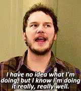
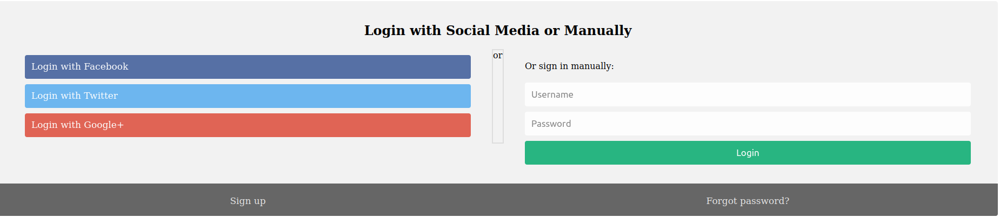

# Secrets

## Description

We have several pages hidden. Can you find the one with the flag?

Additional details will be available after launching your challenge instance.

## Hints

* folders folders folders

## Walkthrough

If we view the sourcecode for the webpage we'll see that the CSS file used by the website is stored in the directory ```secret/assets/```.

```html
<!-- css -->
<link href="secret/assets/index.css" rel="stylesheet" />
```

If we visit the ```secret``` directory we'll see a meme and a message leting us know we're on the right track.

> Finally. You almost found me. you are doing well



In the source code we'll see another hidden directory.

```html
<link rel="stylesheet" href="hidden/file.css" />
```

Navigating to the ```/secret/hidden/``` directory we'll find a login form.



If we try to login with dummy credentials we'll get a JavaScript alert that reads:

> Thank you for the attempt but oops! try harder. better luck next time

The sourcecode for the webpage shows another hidden directory, this one called ```superhidden```.

```html
<link href="superhidden/login.css" rel="stylesheet" />
```

After navigating to the new webpage at ```/secret/hidden/superhidden/``` we'll find a mostly blank page. The only text on this page reads:

> Finally. You found me. But can you see me

```html
<!DOCTYPE html>
<html>
  <head>
    <title></title>
    <link rel="stylesheet" href="mycss.css" />
  </head>

  <body>
    <h1>Finally. You found me. But can you see me</h1>
    <h3 class="flag">picoCTF{succ3ss_@h3n1c@10n_51b260fe}</h3>
  </body>
</html>
```
