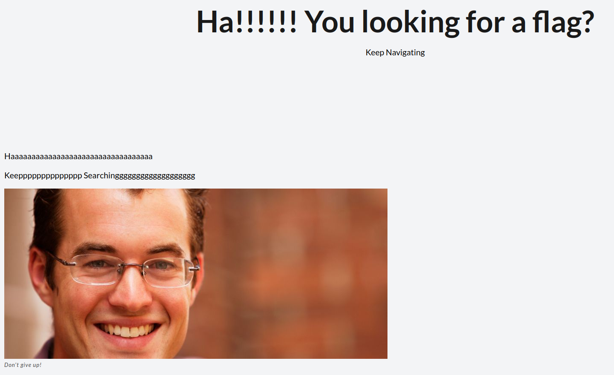
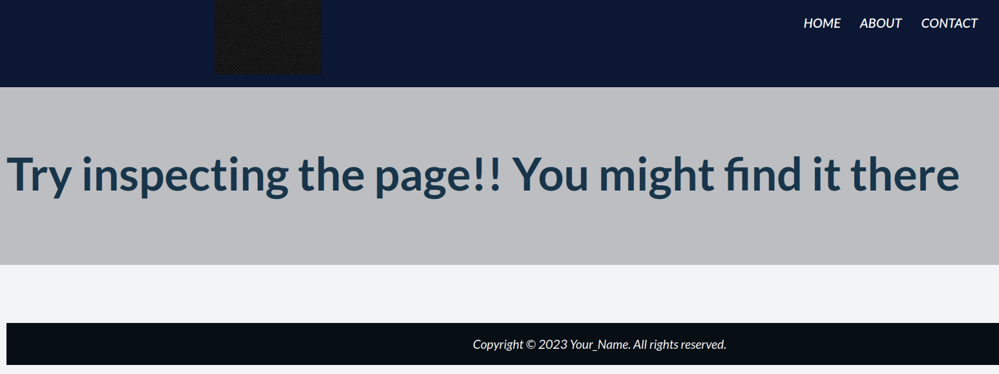

# WebDecode

## Description

Do you know how to use the web inspector?

Additional details will be available after launching your challenge instance.

## Hints

* Use the web inspector on other files included by the web page.

* The flag may or may not be encoded

## Walkthrough

After launching the instance and visiting the website we'll see the homepage for this CTF.



Viewing the source code for the homepage we won't find anything, but the text on the homepage does tell us that if we're looking for a flag to keep navigating.

Navigating over to the websites about page we'll see text that reads, "Try inspecting the page!! You might find it there."



Inspecting the HTML, we'll see the following code.

```html
<!DOCTYPE html>
<html lang="en">
<head>
    <!--...REMOVED FOR BREVITY...-->
    <title>About me</title>
</head>
<body>
    <!--...REMOVED FOR BREVITY...-->
    <section class="about" notify_true="cGljb0NURnt3ZWJfc3VjYzNzc2Z1bGx5X2QzYzBkZWRfMTBmOTM3NmZ9">
    <h1>Try inspecting the page!! You might find it there</h1>
    <!--...REMOVED FOR BREVITY...-->
</body>
</html>
```

As we look through the code, the section element begins to stand out. It has a custom attribute, ```notify_true```, whose value is a Base-64 encoded string.

Base-64 encoded string: ```cGljb0NURnt3ZWJfc3VjYzNzc2Z1bGx5X2QzYzBkZWRfMTBmOTM3NmZ9```

Decoding this string from Base-64 reveals the flag ```picoCTF{web_succ3ssfully_d3c0ded_10f9376f}```.
